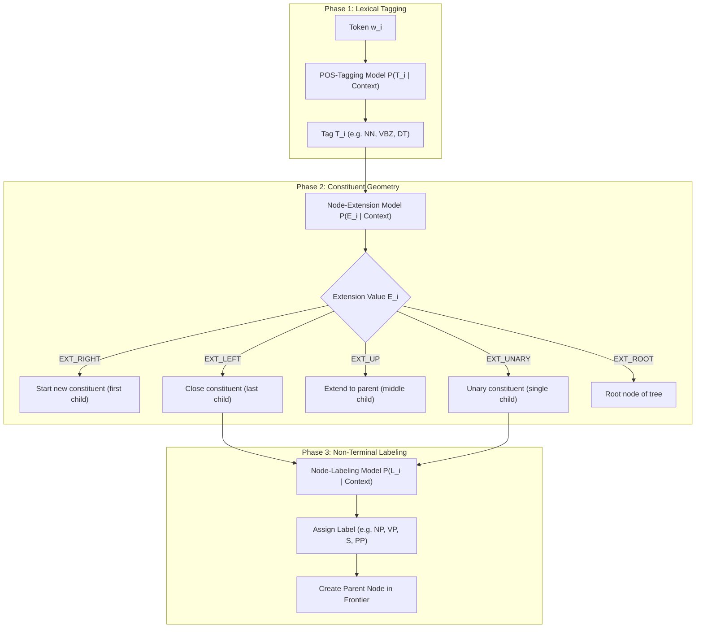

# SPATTER: Natural Language Parsing as Statistical Pattern Recognition
## Mathematical Foundations, Algorithmic Architecture, and Functional C11 Specification
### Reference: David M. Magerman (arXiv:cmp-lg/9405009 / ACL 1995)

---

## 1. Executive Summary & Historical Significance

In natural language processing (NLP), early parsing systems relied extensively on hand-crafted Context-Free Grammars (CFGs) and unification-based rewrite rules. Hand-written grammars suffered from two fundamental limitations:
1. **Brittleness / Coverage Bottlenecks**: As grammars grew larger to cover diverse linguistic phenomena, ambiguity exploded exponentially.
2. **Ad-Hoc Disambiguation**: Grammarians had to devise complex, brittle priority heuristics and exception rules to select the correct parse among thousands of candidate derivations.

In **1994**, David M. Magerman introduced **SPATTER** (*Statistical PATTErn Recognition*), published in **arXiv:cmp-lg/9405009** (*"Natural Language Parsing as Statistical Pattern Recognition"*). Magerman established a revolutionary paradigm: **Syntactic parsing is framed directly as a statistical pattern recognition problem**.

Instead of writing grammar rules, the parser acquires a sequence of statistical decision trees directly from an annotated treebank (such as the Penn Treebank). These decision trees predict the exact sequence of structural actions needed to assemble a parse tree bottom-up, conditioning each decision on rich lexical, syntactic, and contextual features via entropy reduction.

---

## 2. Mathematical Formulation

### 2.1 The Statistical Parsing Problem
Given a sentence consisting of a sequence of $N$ words $W = (w_1, w_2, \dots, w_N)$, the goal of the parser is to find the most probable parse tree $T^*$ from the space of all possible labeled trees $\mathcal{T}$:

$$T^* = \arg\max_{T \in \mathcal{T}} P(T \mid W)$$

By applying Bayes' rule:

$$T^* = \arg\max_{T \in \mathcal{T}} \frac{P(T, W)}{P(W)} = \arg\max_{T \in \mathcal{T}} P(T, W)$$

### 2.2 Derivation Decomposition
A parse tree $T$ is uniquely and deterministically generated through a sequence of $M$ discrete pattern-recognition actions $A = (a_1, a_2, \dots, a_M)$. Using the chain rule of probability:

$$P(T, W) = \prod_{i=1}^{M} P(a_i \mid a_1, a_2, \dots, a_{i-1}, W) = \prod_{i=1}^{M} P(a_i \mid H_i)$$

where $H_i = (a_1, \dots, a_{i-1}, W)$ represents the complete derivation history and input context available at step $i$.

---

## 3. The Three Statistical Decision Models

In SPATTER, the parse tree is constructed bottom-up, left-to-right across the sentence. Every node in the tree is governed by three statistical decision tree models:



### 3.1 Part-of-Speech (POS) Tagging Model
- **Target Distribution**: $P(T_i \mid \text{context})$
- **Task**: Assigns a syntactic category / part-of-speech tag $T_i \in \Sigma_{\text{POS}}$ to each input word $w_i$.
- **Context Features**:
  - Word window: $(w_{i-2}, w_{i-1}, w_i, w_{i+1}, w_{i+2})$
  - Previously predicted tags: $(t_{i-2}, t_{i-1})$
  - Morphological/lexical features (capitalization, suffixes, digits).

### 3.2 Node-Extension Model
- **Target Distribution**: $P(E_i \mid \text{context})$
- **Task**: Determines how the current node attaches to higher-level constituents in the tree.
- **Extension Values ($E_i \in \{ \text{right}, \text{left}, \text{up}, \text{unary}, \text{root} \}$)**:
  1. `EXT_RIGHT`: The node is the **first (leftmost) child** of a multi-child constituent. It extends rightward to join with subsequent siblings.
  2. `EXT_LEFT`: The node is the **last (rightmost) child** of a multi-child constituent. It extends leftward to close the constituent.
  3. `EXT_UP`: The node is a **middle child** (neither first nor last) of a multi-child constituent.
  4. `EXT_UNARY`: The node is the **sole child** of a unary constituent (e.g., $NP \to NN$).
  5. `EXT_ROOT`: The node is the **top-level root** of the entire completed parse tree (typically $S$).

### 3.3 Node-Labeling Model
- **Target Distribution**: $P(L_i \mid \text{context})$
- **Task**: When a constituent boundary is closed (by `EXT_LEFT` or `EXT_UNARY`), this model predicts the non-terminal phrase category $L_i \in \{ S, NP, VP, PP, ADJP, ADVP, SBAR, \dots \}$.
- **Context Features**:
  - Head child word and tag
  - Leftmost child tag/label and rightmost child tag/label
  - Sibling constituent labels to the left
  - Span width and sentence position.

---

## 4. Decision Tree Induction & Probability Estimation

### 4.1 Binary Questions & Feature Clustering
SPATTER decomposes complex, high-arity categorical features (e.g., a vocabulary of 50,000 words or 50 POS tags) into a sequence of binary questions $q: \text{Context} \to \{0, 1\}$.

Categorical features are hierarchically partitioned into subsets based on mutual information, creating binary questions of the form:
$$q(\text{Context}) = [\text{feature\_value} \in C_k]$$

### 4.2 Shannon Entropy & Information Gain
Given a training sample set $S$ of $(x, y)$ pairs where $y \in \mathcal{C}$ is the target class (tag, extension, or label), the empirical Shannon Entropy is:

$$H(S) = -\sum_{c \in \mathcal{C}} p_c \log_2 p_c, \quad p_c = \frac{|\{ (x, y) \in S : y = c \}|}{|S|}$$

A candidate binary question $q$ partitions $S$ into:
- $S_{\text{yes}} = \{ (x, y) \in S : q(x) = \text{true} \}$
- $S_{\text{no}} = \{ (x, y) \in S : q(x) = \text{false} \}$

The Information Gain (entropy reduction) is computed as:

$$\Delta H(S, q) = H(S) - \left( \frac{|S_{\text{yes}}|}{|S|} H(S_{\text{yes}}) + \frac{|S_{\text{no}}|}{|S|} H(S_{\text{no}}) \right)$$

The optimal question $q^*$ selected at node $n$ is:
$$q^* = \arg\max_{q \in \mathcal{Q}} \Delta H(S, q)$$

### 4.3 Stopping Criteria
Tree growth terminates at node $n$ and becomes a leaf when any of the following conditions are met:
1. Pure node: $H(S) = 0$ (all samples belong to one class).
2. Insufficient samples: $|S| < N_{\text{min}}$ (e.g., $N_{\text{min}} = 5$).
3. Negligible gain: $\Delta H(S, q^*) < \epsilon$ (e.g., $\epsilon = 10^{-4}$).
4. Maximum depth reached: $\text{depth} \ge D_{\text{max}}$.

### 4.4 Probability Smoothing (Deleted Interpolation)
To prevent zero-probability estimation on unseen test contexts, leaf distributions are smoothed by interpolating the leaf distribution with the parent node distribution:

$$P_{\text{smooth}}(c \mid \text{leaf}) = \lambda_d P(c \mid \text{leaf}) + (1 - \lambda_d) P_{\text{smooth}}(c \mid \text{parent})$$

where the confidence weight $\lambda_d \in (0, 1)$ depends on the sample count $|S_{\text{leaf}}|$:
$$\lambda_d = \frac{|S_{\text{leaf}}|}{|S_{\text{leaf}}| + K_{\text{prior}}}$$

---

## 5. Bottom-Up Beam Search Decoding

The parsing process searches the space of derivation sequences using **beam search** (stack decoding):

```
Algorithm: SPATTER Functional Beam Search
Input: Sentence W = (w_1, ..., w_N), Models M = (M_pos, M_ext, M_lbl), BeamWidth K
Output: Highest scoring ParseTree T*

1. Initialize Beam B_0 = { InitialState(W) }
2. For each step t = 1, 2, ... until convergence:
   a. Candidates = EmptyList()
   b. For each State S in B_{t-1}:
        If IsComplete(S):
            Candidates.Add(S)
        Else:
            NextStates = ExpandState(M, S)
            Candidates.Concat(NextStates)
   c. B_t = TopK(Candidates, K, Key: LogProbability)
   d. If AllStatesComplete(B_t) or B_t == B_{t-1}:
        Break
3. Return BestState(B_t).ParseTree
```

---

## 6. Functional C11 Architecture & Design Patterns

### 6.1 Core Functional Principles in C11
1. **Immutability by Default**: All tree nodes, list cons-cells, decision trees, and parser states are `const`-qualified immutable data structures.
2. **Algebraic Data Types (ADTs)**:
   - `Option<T>` for computations that may produce no value (`Some(val)` vs `None`).
   - `Result<T, E>` for operations that may fail (`Ok(val)` vs `Err(e)`), replacing global error codes and mutations.
3. **Higher-Order Combinators**: Functions accept function pointers for declarative data transformations (`map`, `filter`, `fold_left`, `fold_right`, `and_then`).
4. **Deterministic Lifetime Management**: Immutable objects are allocated via pure constructors and freed recursively or through arena-scoped lifetimes.

### 6.2 Compliance with Clang Single-Line Rules (`RULE[user_global]`)
- Every function declaration/prototype and definition begins and completes its signature on a single line:
  ```c
  const ParseNode* parse_node_create_leaf(StrView word, Tag tag, double log_prob)
  {
      /* Body */
  }
  ```
- Every variable declaration/initialization is self-contained on a single line:
  ```c
  double gain = entropy_parent - (weight_yes * entropy_yes + weight_no * entropy_no);
  size_t beam_width = 16;
  ```
- No multi-line split parameters or split variable definitions.

---

## 7. Mathematical Verification and Correctness

1. **Law of Total Probability**: At any leaf node $L$, $\sum_{c \in \mathcal{C}} P(c \mid L) = 1.0$.
2. **Log-Probability Additivity**: $\log P(T, W) = \sum_{i=1}^M \log P(a_i \mid H_i) \le 0.0$.
3. **Bracketing Consistency**: Every constituent span $[i, j]$ satisfies $0 \le i \le j < N$, and any two constituents $A=[i_1, j_1]$ and $B=[i_2, j_2]$ are either disjoint ($j_1 < i_2$ or $j_2 < i_1$) or strictly nested ($i_1 \le i_2 \le j_2 \le j_1$).
